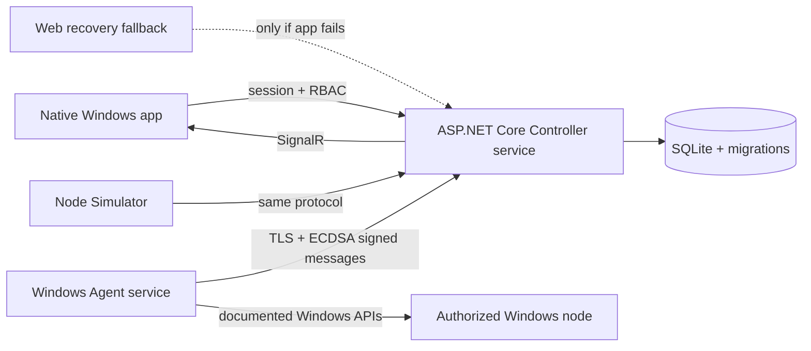

# Veltrix-Control

[](https://github.com/Bradock213lol/Veltrix-Control/actions/workflows/windows-ci.yml)
[](https://github.com/Bradock213lol/Veltrix-Control/releases/latest)
[](LICENSE)
[](https://dotnet.microsoft.com/)
[](#)

**Security-first Windows fleet management for company networks.** One installer configures a
computer as a **Controller**, a **Managed Node**, or both. From the native Windows desktop
app you enroll authorized machines, watch live telemetry, administer processes, services,
power, and terminals, deploy software and updates, protect data with verified backups, run
compute and game-server workloads — every action permission-checked, confirmed, and audited.

> Built for computers you own or are explicitly authorized to administer. The platform never
> hides itself, never bypasses Windows security, and never enrolls a device silently.

```text
Controller (ASP.NET Core service) ── TLS + ECDSA-signed messages ── Managed Nodes (Windows services)
        │                                                                    │
        ├── SQLite database + hash-chained audit trail                        ├── telemetry, files, admin,
        ├── SignalR + REST for the native desktop app                         │   software, updates, backups
        └── Scheduler, alert engine, automation engine                        └── game servers, compute jobs
```

## Contents

- [Feature status](#feature-status)
- [Screens](#screens)
- [Keyboard shortcuts](#keyboard-shortcuts)
- [Install](#install)
- [Architecture](#architecture)
- [Security model](#security-model)
- [Development](#development)
- [Roadmap and not-yet-implemented](#roadmap-and-not-yet-implemented)
- [License](#license)

## Feature status

| Area | What works today |
| --- | --- |
| Enrollment and identity | First-run Owner setup, four roles, single-use 1–60 min codes, per-device ECDSA P-256 identity, replay-resistant signed transport |
| Monitoring | Windows inventory, CPU / memory / disk / uptime telemetry, health scoring, live Overview and Devices views, search and filters |
| Device administration | Processes (start, stop, priority), services (start, stop, startup type), scheduled power, Wake-on-LAN, audited PowerShell/CMD terminals |
| Files | Managed-root browser, create/rename/move/copy/delete, search, folder sizing, ZIP, verified resumable transfers, editor with history and diff |
| Software and updates | Approved WinGet / MSI / EXE deployments with per-device results, Windows Update scan, selective install, reboot reporting |
| Protection | Verified zip backups with retention and safe restore, alert engine with acknowledgement, automation rules with allow-listed actions |
| Compute | Priority job queue, per-node Idle/Server/Compute/Gaming/Maintenance policies with reserved CPU, memory, and disk |
| Game servers | Minecraft Java provisioning, lifecycle, live console, automatic crash restart with crash-loop protection |
| Integrations | Optional Pterodactyl and Docker adapters with AES-GCM encrypted credentials |
| Administration | User accounts and roles, retention, agent-version policy, system diagnostics, hash-chained audit log with CSV export |

Full verified status per release is in [RESULT.md](RESULT.md); the honest gap list is in
[docs/roadmap.md](docs/roadmap.md).

## Screens


Screenshots are regenerated each release from a local simulator fleet. The desktop app is
the primary surface; a browser page is offered only as a recovery fallback when the app
cannot start.

## Keyboard shortcuts

| Shortcut | Action |
| --- | --- |
| `F5` or `Ctrl+R` | Refresh fleet data |
| `Ctrl+F` | Focus the device search box |
| `Ctrl+E` | Create an enrollment code |
| `Ctrl+1` … `Ctrl+9` | Jump to Overview, Devices, Diagnostics, Managed files, Administration, Deployment, Operations, Integrations, Audit |
| `Ctrl+,` | Open Settings |
| `Esc` | Cancel or close the current dialog |
| `Ctrl+S` (editor) | Save the open file |
| `Ctrl+F` (editor) | Find and replace |
| `Enter` | Confirm the default action, send a terminal command, or run a search |

The same list is available inside the app under **Settings → Keyboard shortcuts**, and every
shortcut also has a visible button or menu control.

## Install

1. Download [`Veltrix-Control-Setup.exe`](https://github.com/Bradock213lol/Veltrix-Control/releases/latest/download/Veltrix-Control-Setup.exe)
   and [`SHA256SUMS.txt`](https://github.com/Bradock213lol/Veltrix-Control/releases/latest/download/SHA256SUMS.txt)
   from the [latest release](https://github.com/Bradock213lol/Veltrix-Control/releases/latest).
2. Verify the SHA-256 value, run the installer as administrator, and pick a role.
3. On a Controller, launch **Veltrix-Control**. The app detects that no accounts exist and
   opens first-run setup; create the Owner account there.
4. Select **Add device** to create an enrollment code. The Overview tab keeps a
   getting-started checklist until the first device is online.
5. On a Managed Node install, enter the Controller HTTPS URL, its verified certificate
   fingerprint, the one-time code, and the managed file root.

**Lost Owner password?** After setup the Controller also creates a recovery Administrator
account (`admin` / `admin!` by default — change or delete it in **Settings → User accounts**
once Owner access is restored). On the Controller machine you can also reset a password
without touching any data:

```powershell
$env:VELTRIX_OWNER_PASSWORD = 'a-new-owner-password'
& "$env:ProgramFiles\Veltrix-Control\Controller\Veltrix-Control.Controller.exe" --reset-owner owner-username
Remove-Item Env:\VELTRIX_OWNER_PASSWORD
```

**Uninstall** through Windows Settings removes everything the product created: services,
firewall rule, program files, the database with user accounts, certificates, node
identities, transfers, and desktop settings. Silent uninstalls used by upgrades and repair
preserve state.

The Controller listens on HTTPS `5443` for nodes and loopback HTTP `5187` for the app. Read
the [installer guide](docs/installer.md) before a multi-computer rollout.

## Architecture



Domain and wire contracts are platform-neutral; Windows telemetry, service hosting, and
DPAPI key storage live in the Agent. See [architecture](docs/architecture.md),
[security](docs/security.md), and [protocol](docs/protocol.md).

## Security model

Enrollment is explicit, temporary, and single-use. Each node generates its identity key
locally and protects it with Windows DPAPI; the Controller stores only public keys.
Controller-to-node traffic is TLS with a pinned certificate fingerprint, and every message
is time-bounded and replay-resistant. Administrative operations use a closed operation
enum, per-action permissions, typed validation on both ends, explicit confirmation,
operation IDs, and a node-local policy switch for high-impact actions. Terminals are
audited; protected processes and services cannot be stopped or disabled remotely. The audit
log is hash-chained and tamper-evident.

Report vulnerabilities privately as described in [SECURITY.md](SECURITY.md).

## Development

Requirements: Windows 10/11 or Windows Server, .NET SDK 10.0.401+, and Inno Setup 6 for
packaging.

```powershell
./scripts/start-development.ps1     # build, test, and run the local Controller + desktop app
./scripts/build.ps1                 # full verification and release packaging
```

Simulator fleet:

```powershell
dotnet run --project src/Veltrix-Control.Simulator -- --token YOUR-CODE --name Simulated-PC-01
```

More detail in [development](docs/development.md).

## Roadmap and not-yet-implemented

Delivered: v0.1 secure foundation · v0.2 native control center · v0.3 files and transfers ·
v0.4 controlled administration · v0.5 software and updates · v0.6 backups, alerts,
automation · v0.7 compute scheduling · v0.8 game servers · v0.9 integrations ·
v0.10 administration, retention, recovery, and UI polish.

**Not implemented yet** (tracked in [docs/roadmap.md](docs/roadmap.md)): PostgreSQL
deployment option, Authenticode signing, signed self-update with staged rollout, enterprise
identity, high availability, 1,000-node load qualification, GPU inventory/scheduling,
external alert notifications, device groups/tags/favorites, hardware sensors (temperature,
SMART, battery), and localization. Nothing above is claimed as working.

## License

Veltrix-Control is available under the [MIT License](LICENSE).
