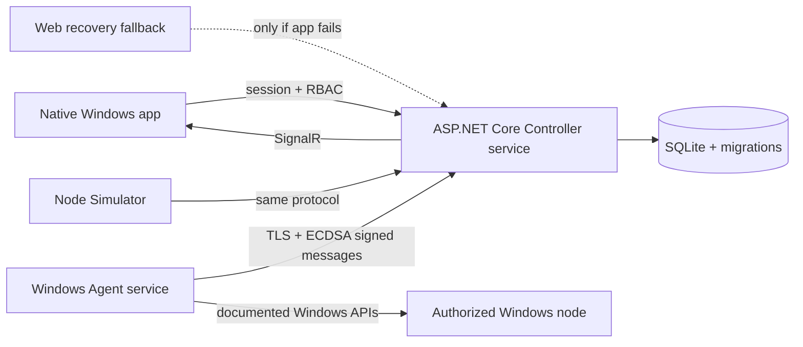

# Veltrix-Control

[](https://github.com/Bradock213lol/Veltrix-Control/actions/workflows/windows-ci.yml)
[](https://github.com/Bradock213lol/Veltrix-Control/releases/latest)
[](LICENSE)

Veltrix-Control is a security-first Windows fleet management platform. One installer can
configure a computer as a **Controller**, **Managed Node**, or both. Version 0.3.0 adds
write-capable managed file operations, chunked verified transfers, and a built-in file
editor with history, on top of the native Windows control center introduced in 0.2.0.

> This project is for systems owned by or explicitly authorized by the administrator.
> It does not hide its services, bypass Windows security, or silently enroll devices.

## What works in v0.3.0

- First-run Owner setup, secure cookie sessions, four-role permission model
- Single-use 1–60 minute enrollment codes
- Per-device ECDSA P-256 identity; the Controller stores only public keys
- Signed, time-bounded, replay-resistant heartbeats and operation results
- Windows hardware inventory plus live CPU, RAM, disk, and uptime telemetry
- Native resizable Windows app with system light/dark theme and keyboard shortcuts
- Fleet metrics, manual/automatic refresh, status feedback, search, filters, and sorting
- Device profiles with OS, CPU, memory, uptime, agent, heartbeat, IDs, and disk capacity
- Read-only remote process, Windows service, installed-software, and network inventories
- Confirmed restart/shutdown queue with a separate local node policy switch
- Managed-root file management: create, rename, move, copy, delete, search, size, ZIP
- Chunked, resumable, checksum-verified uploads and downloads with progress and cancellation
- Text editor with find/replace, atomic saves, pre-save backups, history, and diff view
- Hardened path policy: traversal, UNC/device paths, ADS, reparse points, and zip-slip
- Searchable hash-chained audit history, integrity verification, and CSV export
- In-app enrollment code creation, expiry display, copy, rotation, and revocation
- Saved Controller address, secure remote-HTTPS validation, and refresh preferences
- Clearly labelled multi-node simulator for safe development
- One role-selecting Inno Setup EXE with native launcher, repair/upgrade/uninstall support,
  and an automatic browser-fallback prompt only when the app fails to start
- Unit, Agent diagnostic, integration, security, end-to-end, and installer test suites


## Architecture



The domain and wire contracts do not depend on Windows. Windows-specific telemetry,
service hosting, and DPAPI key storage live in the Agent. See
[architecture](docs/architecture.md), [security](docs/security.md), and
[protocol](docs/protocol.md) for the boundaries and threat model.

## Install

1. Download [`Veltrix-Control-Setup.exe`](https://github.com/Bradock213lol/Veltrix-Control/releases/latest/download/Veltrix-Control-Setup.exe)
   and [`SHA256SUMS.txt`](https://github.com/Bradock213lol/Veltrix-Control/releases/latest/download/SHA256SUMS.txt)
   from the [latest release](https://github.com/Bradock213lol/Veltrix-Control/releases/latest).
2. Verify the SHA-256 value, run the installer as administrator, and select a role.
3. For a Controller, launch **Veltrix-Control** from Start or the desktop and create the
   first Owner account in the app.
4. Select **Add device** in the app to generate an enrollment code.
5. On a Managed Node install, enter the Controller HTTPS URL, its displayed/verified
   certificate thumbprint, the one-time code, and the allowed file root.

The Controller service listens on HTTPS port `5443` for nodes and loopback HTTP port
`5187` for the native app. The launcher offers that local browser endpoint only if the
app is missing or closes during startup. Read the [installer guide](docs/installer.md)
before a multi-computer deployment.

## Development

Requirements: Windows 10/11 or Windows Server, .NET SDK 10.0.401+, and Inno Setup 6
for packaging.

```powershell
./scripts/start-development.ps1
```

Complete verification and release packaging:

```powershell
./scripts/build.ps1
```

For simulator use, create a code in the UI, then run:

```powershell
dotnet run --project src/Veltrix-Control.Simulator -- --token YOUR-CODE --name Simulated-PC-01
```

More detail is in [development](docs/development.md) and the phased release plan is
in [PHASES.md](PHASES.md).

## Security model

Enrollment is explicit, temporary, and single-use. Each node generates its identity
key locally; the real Agent protects its private key with Windows DPAPI. Remote
commands use a closed operation enum, permission checks, confirmations, operation
IDs, and local node policy. No arbitrary terminal exists in v0.2. Power actions
are disabled on every real node until an administrator opts in locally.

Report suspected vulnerabilities privately as described in [SECURITY.md](SECURITY.md).

## Roadmap

- **v0.2:** native control center and first read-only Windows diagnostics — delivered.
- **v0.3:** expanded observability, safe file operations, resumable transfers, and editor.
- **v0.4:** controlled processes, services, power scheduling, and audited terminal.
- **v0.5:** approved software deployment and Windows Update lifecycle.
- **v0.6:** verified backups, alerts, and loop-safe automation.
- **v0.7:** resource policies and distributed compute scheduling.
- **v0.8:** adapter-based game-server management, starting with Minecraft Java.
- **v0.9:** optional Pterodactyl and Docker integrations.
- **v1.0:** signed staged updates, PostgreSQL, enterprise identity, scale, and
  production/security hardening.

Each milestone is an independently installable, upgrade-tested release. The complete
acceptance gates are in [PHASES.md](PHASES.md), and current verified status is maintained
in [RESULT.md](RESULT.md).

## License

Veltrix-Control is available under the [MIT License](LICENSE).
