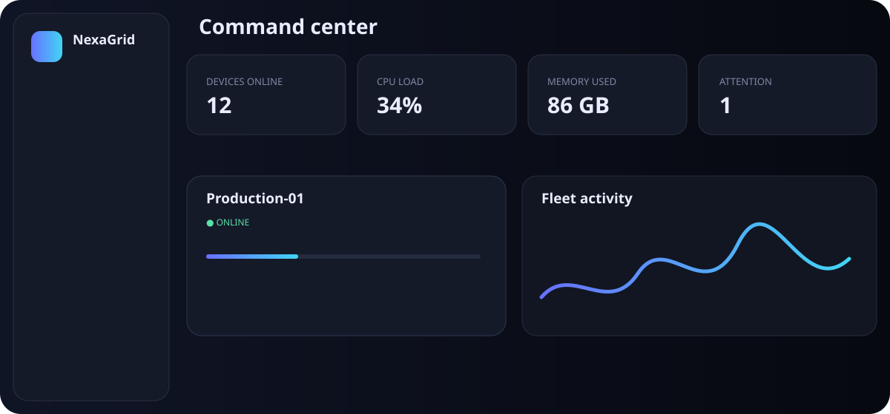
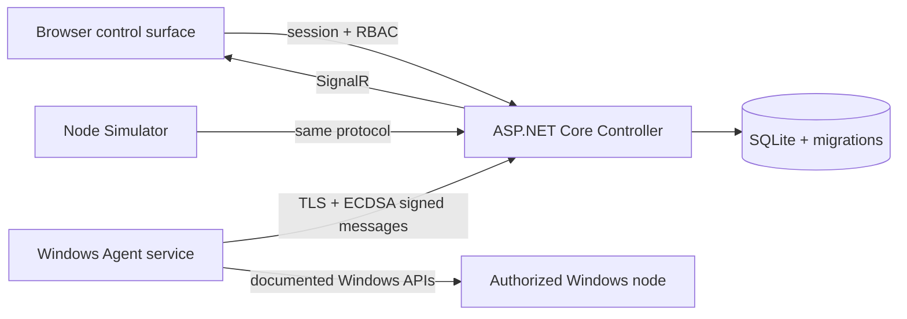

# NexaGrid

NexaGrid is a security-first Windows fleet management platform. One installer can
configure a computer as a **Controller**, **Managed Node**, or both. Version 0.1.0
is a finished Phase 1 vertical slice: enroll an authorized device, see live health,
browse its allowed file root, issue guarded power requests, and inspect every action.

> This project is for systems owned by or explicitly authorized by the administrator.
> It does not hide its services, bypass Windows security, or silently enroll devices.

## What works in v0.1.0

- First-run Owner setup, secure cookie sessions, four-role permission model
- Single-use 1–60 minute enrollment codes
- Per-device ECDSA P-256 identity; the Controller stores only public keys
- Signed, time-bounded, replay-resistant heartbeats and operation results
- Windows hardware inventory plus live CPU, RAM, disk, and uptime telemetry
- Automatic online/offline status, health score, and SignalR-driven updates
- Confirmed restart/shutdown queue with a separate local node policy switch
- Asynchronous remote file listing confined to the node's configured root
- Hash-chained audit log with an integrity verification endpoint
- Clearly labelled multi-node simulator for safe development
- One role-selecting Inno Setup EXE with repair/upgrade/uninstall support
- Unit, integration, security, and end-to-end test suites



## Architecture



The domain and wire contracts do not depend on Windows. Windows-specific telemetry,
service hosting, and DPAPI key storage live in the Agent. See
[architecture](docs/architecture.md), [security](docs/security.md), and
[protocol](docs/protocol.md) for the boundaries and threat model.

## Install

1. Download `NexaGridSetup.exe` and `SHA256SUMS.txt` from the Windows CI artifact.
2. Verify the SHA-256 value, run the installer as administrator, and select a role.
3. For a Controller, open `http://localhost:5187` and create the first Owner account.
4. In **Add device**, generate an enrollment code.
5. On a Managed Node install, enter the Controller HTTPS URL, its displayed/verified
   certificate thumbprint, the one-time code, and the allowed file root.

The Controller listens on HTTPS port `5443` for nodes and loopback HTTP port `5187`
for local administration. Read the [installer guide](docs/installer.md) before a
multi-computer deployment.

## Development

Requirements: Windows 10/11 or Windows Server, .NET SDK 10.0.401+, and Inno Setup 6
for packaging.

```powershell
./scripts/start-development.ps1
```

Complete verification and release packaging:

```powershell
./scripts/build.ps1
```

For simulator use, create a code in the UI, then run:

```powershell
dotnet run --project src/NexaGrid.Simulator -- --token YOUR-CODE --name Simulated-PC-01
```

More detail is in [development](docs/development.md) and the phased release plan is
in [PHASES.md](PHASES.md).

## Security model

Enrollment is explicit, temporary, and single-use. Each node generates its identity
key locally; the real Agent protects its private key with Windows DPAPI. Remote
commands use a closed operation enum, permission checks, confirmations, operation
IDs, and local node policy. No arbitrary terminal exists in Phase 1. Power actions
are disabled on every real node until an administrator opts in locally.

Report suspected vulnerabilities privately as described in [SECURITY.md](SECURITY.md).

## Roadmap

- **v0.2:** fleet observability and read-only Windows diagnostics.
- **v0.3:** safe file operations, resumable transfers, and configuration editor.
- **v0.4:** controlled processes, services, power scheduling, and audited terminal.
- **v0.5:** approved software deployment and Windows Update lifecycle.
- **v0.6:** verified backups, alerts, and loop-safe automation.
- **v0.7:** resource policies and distributed compute scheduling.
- **v0.8:** adapter-based game-server management, starting with Minecraft Java.
- **v0.9:** optional Pterodactyl and Docker integrations.
- **v1.0:** signed staged updates, PostgreSQL, enterprise identity, scale, and
  production/security hardening.

Each milestone is an independently installable, upgrade-tested release. The complete
acceptance gates are in [PHASES.md](PHASES.md), and current verified status is maintained
in [RESULT.md](RESULT.md).
