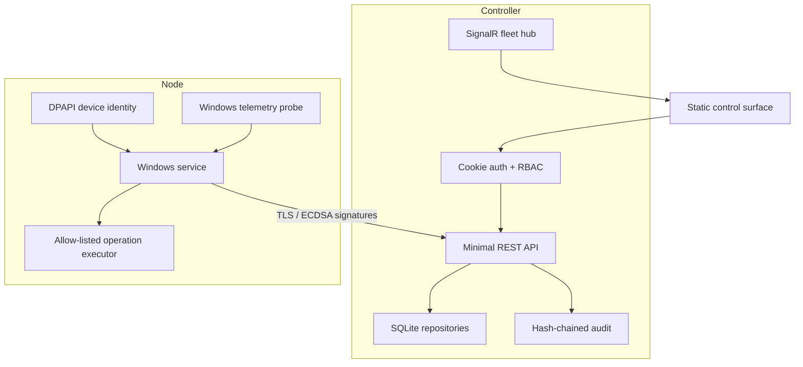

# Architecture

## Phase 1 boundaries

NexaGrid uses a modular monolith for the Controller and a separate, visible Windows
service for the Agent. This is deliberately simpler than a distributed control plane
while the product proves its security and operation model.

## Projects

- `NexaGrid.Contracts` (assembly `NexaGrid.Shared`): transport records and enums.
- `NexaGrid.Core`: cryptography, permissions, path policy, and health scoring.
- `NexaGrid.Infrastructure`: SQLite schema/migrations and persistence.
- `NexaGrid.Controller`: HTTPS API, authentication, SignalR, and control surface.
- `NexaGrid.Agent`: service host, telemetry, protected identity, and operations.
- `NexaGrid.Simulator`: development node using the production wire protocol.

The Controller is stateless above SQLite. All operation states are explicit:
`Queued`, `Running`, `Succeeded`, `Failed`, `Cancelled`, or `TimedOut`. The Agent
contract has no Windows types, leaving a future Linux agent possible without changing
Controller domain logic.

## Scale path

SQLite and a single Controller target the first 10–100 devices. Metrics are indexed by
device/time and kept for 30 days. The persistence boundary can move to PostgreSQL in
the v1.0 hardening phase. Phase 1 intentionally avoids message brokers and distributed
coordination until measured load requires them.
